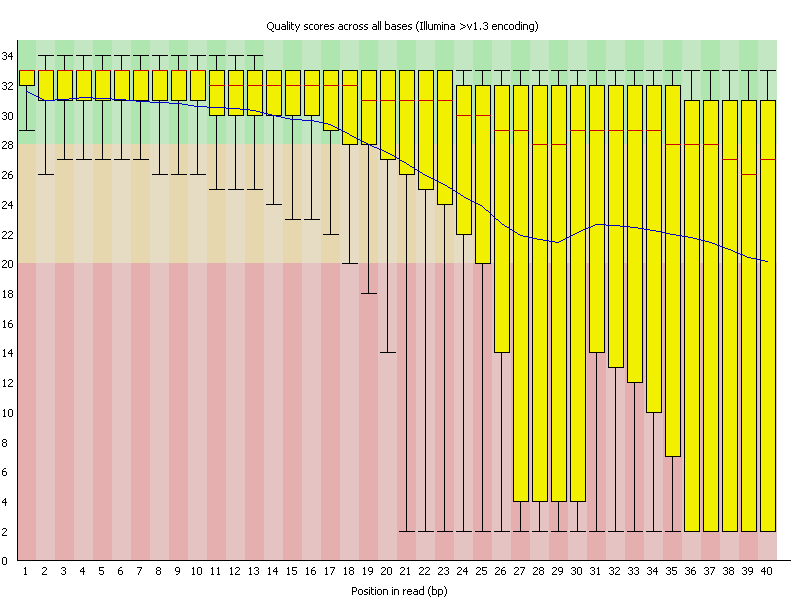
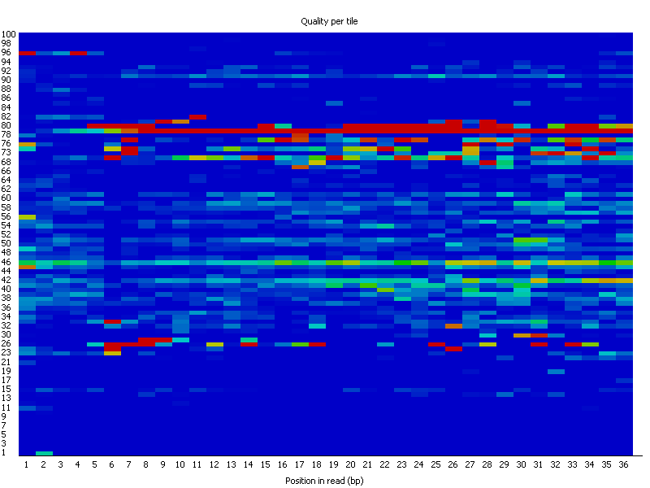
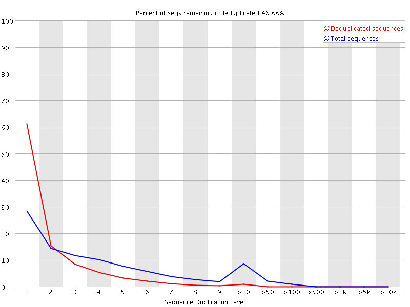

## Why do we do a quality check?

Before analysing sequencing data to draw biological conclusions you should always perform some simple quality control checks to ensure that the **raw data looks good and there are no problems or biases in your data** which may affect how you can usefully use it.

## What is FastQC?

FastQC aims to provide a QC report which can spot problems which originate either in the sequencer or in the starting library material.

> ##Downloading FastQC
> ~~~
> wget http://www.bioinformatics.babraham.ac.uk/projects/fastqc/fastqc_v0.11.5.zip
> unzip fastqc_v0.11.5.zip
> cd FastQC
> chmod +x fastqc
> ~~~
{:.bash}

## A review on the illumina sequencing technology

https://www.youtube.com/watch?v=HMyCqWhwB8E

## Running FastQC
Let's do a quality check on the runs you would have downloaded from IVLE. They are the first 1 million reads of a paired-end RNA-seq experiment. 

~~~
fastqc SRRXXX_1.fastq.gz SRRXXX_2.fastq.gz
~~~
{: .bash}

Fastqc will produce a .html file which is the quality checking output. Further details of the report and the individual pictures can be found in the zip file. 

## Analysing a FastQC report

**Per Base Sequence Quality**

> Common reasons for warnings
> 
> General degradation of quality over the duration of long runs.
>
> * The most common remedy is to perform quality trimming 
>
> Short loss of quality earlier in the run, which then recovers to produce later good quality sequence.You can normally see this type of error by looking at the per-tile quality plot. 
>
> * Consider masking bases during subsequent mapping or assembly.
>
> If your library has reads of varying length then you can find a warning or error is triggered from this module because of very low coverage for a given base range. 

**Per Tile Sequence Quality**

The colours are on a scale from cold ( quality => average quality) to hot (quality < average quality). **A good plot should be blue all over.**

> Common reasons for warnings
>
> It has been observed that greater variation in the phred scores attributed to tiles can also appear when a flowcell is generally overloaded. 

**Per Sequence Quality Scores**

The per sequence quality score report allows you to see if a subset of your sequences have universally low quality values. 

> Common reasons for warnings
>
> Errors here usually indicate a general loss of quality within a run.Evaluation with tile quality might shed insight to error. 
>
>*For long runs this may be alleviated through quality trimming. 

**Per Base Sequence Content**

In a random library you would expect that there would be little to no difference between the different bases of a sequence run, so the lines in this plot should run parallel with each other. 

> Common reasons for warnings
>
> 1. Overrepresented sequences 
> 2. Biased fragmentation
> 3. Biased composition libraries
> 4. Library which has been aggressively adapter trimmed.

Whilst this is a true technical bias, it isn't something which can be corrected by trimming and in most cases doesn't seem to adversely affect the downstream analysis. It will however produce a warning or error in this module.

**Per Sequence GC Content**

In a normal random library you would expect to see a roughly normal distribution of GC content where the central peak corresponds to the overall GC content of the underlying genome. Since we don't know the the GC content of the genome the modal GC content is calculated from the observed data and used to build a reference distribution.

> Common reasons for warnings
>
> Warnings in this module usually indicate a problem with the library. 
>
> *Sharp peaks on an otherwise smooth distribution are normally the result of a specific contaminant (adapter dimers for example), which may well be picked up by the overrepresented sequences module. 
>
> *Broader peaks may represent contamination with a different species.

**Per Base N Content**

If a sequencer is unable to make a base call with sufficient confidence then it will normally substitute an N rather than a conventional base call.

> Common reasons for warnings
> 
> The most common reason for the inclusion of significant proportions of Ns is a general loss of quality.

**Sequence Length Distribution**

For some sequencing platforms it is entirely normal to have different read lengths so warnings here can be ignored.

**Duplicate Sequences**

In a diverse library most sequences will occur only once in the final set. A low level of duplication may indicate a very high level of coverage of the target sequence, but a high level of duplication is more likely to indicate some kind of enrichment bias (eg PCR over amplification).

There are two lines on the plot. The blue line takes the full sequence set and shows how its duplication levels are distributed. In the red plot the sequences are de-duplicated and the proportions shown are the proportions of the deduplicated set which come from different duplication levels in the original data.

In a **properly diverse library** most sequences should fall into the far left of the plot in both the red and blue lines. A general level of enrichment, indicating broad oversequencing in the library will tend to flatten the lines. 

 * More specific enrichments of subsets, or the presence of low complexity contaminants will tend to produce spikes towards the right of the plot. 

 * These high duplication peaks will most often appear in the blue trace but usually disappear in the red trace as they make up an insignificant proportion of the deduplicated set. 

If peaks persist in the blue trace then this suggests that there are a large number of different highly duplicated sequences which might indicate either a contaminant set or a very severe technical duplication.

> Common reasons for warnings
>
> In general there are two potential types of duplicate in a library, technical duplicates arising from PCR artefacts, or biological duplicates which are natural collisions where different copies of exactly the same sequence are randomly selected. From a sequence level there is no way to distinguish between these two types and both will be reported as duplicates here.
>
>A warning or error in this module is simply a statement that you have exhausted the diversity in at least part of your library and are re-sequencing the same sequences. 

> Note
>
> However in some library types you will naturally tend to over-sequence parts of the library and therefore generate duplication and will therefore expect to see warnings or error from this module.

**Overrepresented Sequences**

A normal high-throughput library will contain a diverse set of sequences, with no individual sequence making up a tiny fraction of the whole. Finding that a single sequence is very overrepresented in the set either means that it is highly biologically significant, or indicates that the library is contaminated, or not as diverse as you expected.

> Common reasons for warnings
>
> This module will often be triggered when used to analyse small RNA libraries where sequences are not subjected to random fragmentation, and the same sequence may naturally be present in a significant proportion of the library.

**Adapter Content**

The sequences will need to be adapter trimmed before proceeding with any downstream analysis.

**Kmer Content**

The Kmer module starts from the assumption that any small fragment of sequence should not have a positional bias in its apearance within a diverse library. There may be biological reasons why certain Kmers are enriched or depleted overall, but these biases should affect all positions within a sequence equally. 

> Common reasons for warnings
>
> Any individually overrepresented sequences, even if not present at a high enough threshold to trigger the overrepresented sequences module will cause the Kmers from those sequences to be highly enriched in this module. Libraries which derive from random priming will nearly always show Kmer bias at the start of the library due to an incomplete sampling of the possible random primers.
